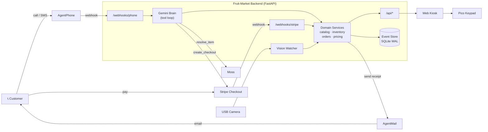
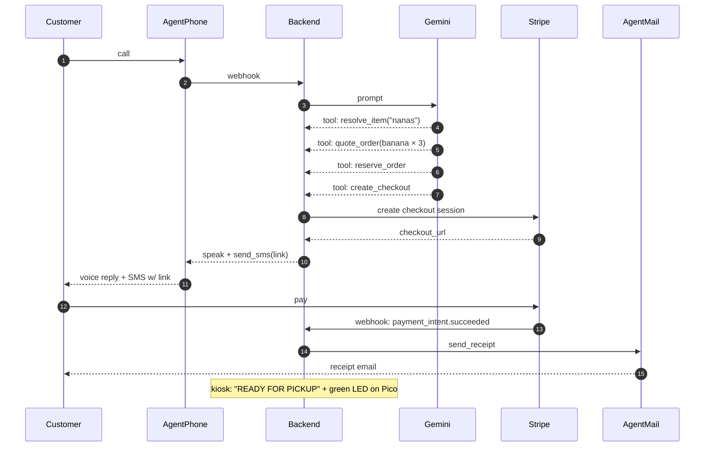
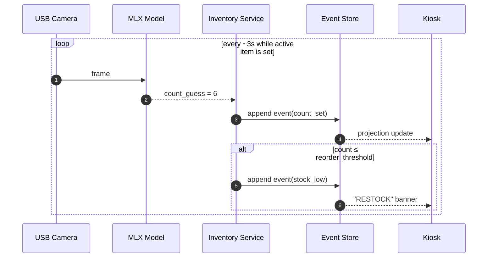
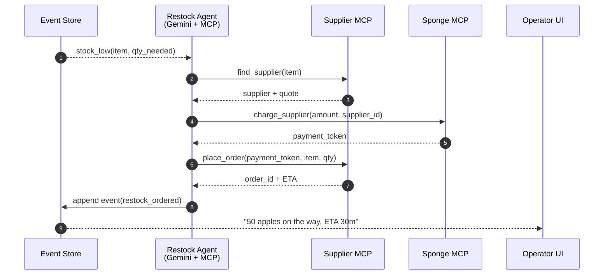

# Architecture

Fruit Market is a physical AI agent for a single-stall market operator.
Customers call a phone number, talk to the agent, pay via a link, and
collect at the counter. Behind the counter, a camera keeps inventory
honest and a small embedded keypad lets the operator confirm things by
hand when needed.

This document covers:

1. [Components at run time](#1-components-at-run-time)
2. [Customer happy path](#2-customer-happy-path--call-to-ready-for-pickup)
3. [Vision loop](#3-vision-loop--what-keeps-inventory-honest)
4. [Module layout](#4-module-layout--what-the-repo-will-look-like-by-end-of-mvp)
5. [Stretch: Sponge auto-restock](#5-stretch--sponge-auto-restock-mvp1)
6. [Invariants](#6-invariants)

ASCII versions are shown first (renders in any terminal). A Mermaid
version follows each one and renders inline on the GitHub repo page.

---

## 1) Components at run time

```
                              ┌───────────────────────────────┐
                              │       INTERNET / CLOUD        │
                              └───────────────────────────────┘
                                  │           │           │
                          ┌───────┘           │           └─────────┐
                          ▼                   ▼                     ▼
                    ┌──────────┐        ┌──────────┐         ┌──────────┐
   📞 customer  ◄──►│AGENTPHONE│        │  STRIPE  │ ◄──► 💳 │ AGENTMAIL│ ───► 📧
   voice/SMS        │ sponsor  │        │ sponsor  │  pay    │ sponsor  │ receipt
                    └────┬─────┘        └────┬─────┘         └────▲─────┘
                         │ webhook           │ webhook            │ send
                         │                   │                    │
              ┌──────────┴───────────────────┴────────────────────┴──────────┐
              │                                                              │
              │            FRUIT-MARKET BACKEND   (FastAPI, Python 3.12)     │
              │                                                              │
              │   ┌─────────────────────────────────────────────────────┐   │
              │   │  ROUTERS                                            │   │
              │   │   /webhooks/phone   /webhooks/stripe   /api/*       │   │
              │   └────────────────┬───────────────────────┬────────────┘   │
              │                    ▼                       │                │
              │   ┌─────────────────────────────┐          │                │
              │   │  GEMINI BRAIN  (tool loop)  │          │                │
              │   │  resolve · quote · reserve  │          │                │
              │   │  checkout · venue_info      │          │                │
              │   └──────┬──────────────┬───────┘          │                │
              │          │              │                  │                │
              │          ▼              ▼                  ▼                │
              │   ┌─────────────┐  ┌─────────────────────────────────┐     │
              │   │ MOSS client │  │   DOMAIN SERVICES               │     │
              │   │ (semantic   │  │   catalog · inventory · orders  │     │
              │   │  resolve)   │  │   pricing · reservations        │     │
              │   └─────┬───────┘  └────────────┬────────────────────┘     │
              │         │ HTTPS                 ▼                          │
              │         │             ┌──────────────────────┐             │
              │         ▼             │  EVENT STORE (SQLite │             │
              │   ┌──────────┐        │  WAL, append-only)   │             │
              │   │   MOSS   │        └──────────────────────┘             │
              │   │ sponsor  │                                              │
              │   └──────────┘                                              │
              │                                                              │
              │   ┌─────────────────────────────────────────────────────┐   │
              │   │  VISION WATCHER  (asyncio task, every ~3s)          │   │
              │   │       USB cam ─► MLX edge model ─► reconcile        │   │
              │   └─────────────────────────────────────────────────────┘   │
              └──────────────────┬───────────────────┬────────────────────┘
                                 │                   │
                          ┌──────┴──────┐     ┌──────┴──────┐
                          │ USB camera  │     │ WEB KIOSK   │
                          │ (Logitech)  │     │ /index.html │
                          └─────────────┘     └─────────────┘
                                                     ▲
                                                     │ (operator iPad/Mac)
                                                     │
                                              ┌──────┴──────┐
                                              │ PICO keypad │
                                              │ (USB serial)│
                                              └─────────────┘
```



---

## 1a) Model choices — edge vs cloud

Two language models in the system. They do different work, and
each got picked for a deliberate reason.

| Model | Where | Job | Why this one |
|---|---|---|---|
| **PaliGemma 2 3B mix-224** | Edge (MLX on Mac) | Perception — counts visible inventory via the native ``count {noun}\n`` task | Vision-specialised model. ~0.5 s per count warm; integer responses; deterministic with greedy decoding. No round-trip to cloud, no per-tick spend. |
| **Gemini 3.1 Flash Lite** | Cloud (Google AI) | Routing — parses caller intent, picks a tool (``resolve_item``, ``quote_order``, ``reserve_order``, ``create_checkout``…), formats a one-sentence reply | Fast tool-calling small model. ~0.7 s end-to-end in our smoke tests. Cheap enough to run on every phone turn, with multilingual caller support from Gemini Flash Lite. |

### Why Flash Lite and not the larger Flash models

The phone brain isn't doing reasoning-heavy work. By the time it
runs, perception has already happened at the edge: PaliGemma
counted, the inventory projection is current, the catalog knows
the prices. The brain's job is to listen for "do you have bananas?"
and decide *call the resolve_item tool, then quote_order, then
reserve_order*. That's routing, not deliberation.

Flash Lite handles it in well under a second. Bumping to
``gemini-2.5-flash`` triples the latency without measurably
changing the routing decisions on the prompts we send. The
override is one env var (``GEMINI_MODEL=gemini-2.5-flash``) for
the rare demo that benefits.

### Why not Gemini Live API

The Live API is for low-latency bidirectional **audio** streaming
— useful when the model itself is doing voice-to-voice
conversation. We don't need that: AgentPhone already owns the
audio leg (it transcribes the caller and synthesises the reply).
The brain only ever sees text. Live's extra complexity (WebSocket
session lifecycle, audio chunk handling, two-way state) would buy
us nothing the AgentPhone webhook + Flash Lite request/response
pair doesn't already cover.

### Why not local-only

We tried local-only Gemma for the brain in early sketches.
PaliGemma owns 5.7 GB of unified memory once loaded; running a
second multi-billion-parameter model alongside it on a 16 GB Mac
pushes against the RAM ceiling, and tool-calling on quantised
local LLMs is noticeably more fragile than on Flash Lite. The
cloud call costs about a tenth of a cent per phone turn and ships
in <1 s, so the split is "perception at the edge, routing in the
cloud."

---

## 2) Customer happy path — call to "ready for pickup"

```
 Customer    AgentPhone   Backend       Gemini      Stripe      AgentMail
 ────────    ──────────   ───────       ──────      ──────      ─────────
    │            │            │            │           │             │
    │── call ───►│            │            │           │             │
    │            │─ webhook ─►│            │           │             │
    │            │            │── prompt ─►│           │             │
    │            │            │◄─ tool ────│ resolve_item("nanas")    │
    │            │            │── search ─────────► MOSS / lexical    │
    │            │            │◄─ tool ────│ quote_order(banana×3)    │
    │            │            │◄─ tool ────│ reserve_order            │
    │            │            │◄─ tool ────│ create_checkout          │
    │            │            │────────────────────► │             │
    │            │            │◄─ checkout_url ──── │             │
    │            │◄─ speak ───│            │           │             │
    │◄── voice ──│            │            │           │             │
    │◄── SMS w/ Stripe link ──│            │           │             │
    │                                                                │
    │─ tap link, pay on Stripe Checkout ────────────►│             │
    │                          │◄── webhook: paid ───│             │
    │                          │── append paid event                  │
    │                          │─────────────────────────────────────►│
    │◄─────────────────────────── receipt email ─────────────────────│
    │                          │                                      │
                               │── flash green ─► Pico keypad
                               │── "READY FOR PICKUP" ─► kiosk UI
```



---

## 3) Vision loop — what keeps inventory honest

```
   USB cam              MLX model             Inventory service
   ───────              ─────────             ─────────────────
      │                     │                       │
      │── frame ───────────►│                       │
      │                     │── prompt:             │
      │                     │   "count bananas"     │
      │                     │── count = 6 ─────────►│
      │                                             │
      │                                  reconcile_physical_count(item, 6)
      │                                             │
      │                                             ▼
      │                                  ┌──────────────────────┐
      │                                  │  event: count_set     │
      │                                  │  → projection updates │
      │                                  │  → broadcast to kiosk │
      │                                  └──────────────────────┘
                                                    │
                                                    ▼
                                          if count ≤ reorder_threshold:
                                              event: stock_low
                                              → kiosk shows "RESTOCK"
```



---

## 4) Module layout — what the repo will look like by end of MVP

```
fruit-market/
├── pyproject.toml
├── Makefile                       # make dev / make check / make test
├── README.md
├── .env.example                   # ← shipped
├── fruit_market/
│   ├── api/
│   │   ├── app.py                 # FastAPI bootstrap
│   │   ├── phone_webhook.py       # AgentPhone → brain
│   │   ├── stripe_webhook.py      # paid → mark order
│   │   └── routes.py              # /api/* for the kiosk
│   ├── brain/
│   │   ├── gemini.py              # tool-calling loop
│   │   ├── tools.py               # resolve · quote · reserve · checkout
│   │   └── prompts.py
│   ├── services/
│   │   ├── catalog.py
│   │   ├── inventory.py           # ← vision watcher writes here
│   │   ├── orders.py
│   │   ├── pricing.py             # integer cents only
│   │   └── reservations.py
│   ├── state/
│   │   ├── events.py              # event schema
│   │   ├── store.py               # SQLite WAL
│   │   └── projections.py
│   ├── vision/
│   │   ├── camera.py              # AVFoundation snapshot
│   │   ├── model.py               # MLX runtime
│   │   └── watcher.py             # asyncio poll loop
│   ├── integrations/
│   │   ├── agentphone.py
│   │   ├── stripe_checkout.py
│   │   ├── agentmail.py
│   │   └── moss.py                # RPC client: POST /manage
│   ├── hardware/
│   │   └── pico.py                # USB serial bridge
│   └── ui/
│       ├── index.html
│       └── app.js
├── scripts/
│   └── check_sponsors.py          # Phase 0: sponsor reachability probe
└── tests/
    ├── unit/                      # services, pricing, parser
    ├── contract/                  # webhook envelopes
    └── e2e/                       # call → paid → packed (mocked sponsors)
```

---

## 5) Stretch — Sponge auto-restock (MVP+1)

When stock for an item hits the reorder threshold, the system should
self-heal: find a supplier, place an order, pay the supplier, and tell
the operator help is on the way. None of that needs a human in the
loop for the demo to land.

**Three building blocks:**

- **Sponge** — an agent-native payment rail. The Fruit Market backend
  funds a Sponge balance once, then the restock agent draws from it
  per restock. No card numbers leave the backend.
- **MCP server** — Sponge is exposed to our agent as MCP tools (e.g.
  `sponge.charge_supplier`, `sponge.list_recent_charges`). The brain
  doesn't import a Sponge SDK; it discovers Sponge through MCP and
  treats it like any other tool. Supplier discovery (find_supplier,
  quote_supplier, place_order) lives on its own MCP server next to it.
- **Restock agent** — a second, smaller Gemini agent triggered by the
  `stock_low` event. Different system prompt and tool set from the
  customer-facing brain; same model, same SDK. Keeping it as a
  separate agent means we never accidentally let a phone caller place
  a wholesale order.

**Flow (only fires when `MOSS_ENABLED=1` and `SPONGE_ENABLED=1`):**

```
 Event store         Restock agent          Supplier MCP       Sponge MCP        Operator UI
 ───────────         ─────────────          ────────────       ──────────        ───────────
     │                     │                       │                  │                │
     │── stock_low ───────►│                       │                  │                │
     │   (item=apples,     │                       │                  │                │
     │    qty_needed=50)   │                       │                  │                │
     │                     │── tool: ─────────────►│                  │                │
     │                     │   find_supplier       │                  │                │
     │                     │◄─ supplier + quote ───│                  │                │
     │                     │                       │                  │                │
     │                     │── tool: ────────────────────────────────►│                │
     │                     │   sponge.charge       │                  │                │
     │                     │◄─ payment_token ─────────────────────────│                │
     │                     │                       │                  │                │
     │                     │── tool: ─────────────►│                  │                │
     │                     │   place_order(token)  │                  │                │
     │                     │◄─ order_id + ETA ─────│                  │                │
     │                     │                                                            │
     │◄── restock_ordered ─│                                                            │
     │                                                                                   │
     └─── projection ──────────────────────────────────────────────────────────────────►│
                                                                  "50 apples on the way,
                                                                       ETA 30m"
```



**Why MCP and not just another tool in the main brain:**

- MCP servers are out-of-process. If the supplier MCP crashes mid-call,
  the customer-facing brain is unaffected.
- Sponge is a payments surface — we want a clear audit boundary
  between "the brain that talks to customers" and "the agent that
  spends money." Two processes, two configs, two log streams.
- We can demo Sponge as a separately-running MCP service that any
  agent could plug into, not just ours. Good story for judges.

**What needs to be added (when we get to it):**

- Env block: `SPONGE_API_BASE`, `SPONGE_API_KEY`, `SPONGE_ENABLED`,
  plus a `SUPPLIERS_MCP_URL` for the supplier discovery server.
- `fruit_market/integrations/sponge_mcp.py` — thin MCP client.
- `fruit_market/brain/restock_agent.py` — second Gemini agent, fires
  on `stock_low`, idempotent so a flapping count doesn't double-order.
- A `reorder_threshold` field on `catalog.item` (already implied by
  the watcher's `stock_low` event).

---

## 6) Invariants

A handful of choices that are not negotiable once the code starts
landing — getting these wrong is what makes a demo fall apart on
stage.

1. **One source of truth for inventory.** The phone agent and the
   dashboard both read `inventory.physical_count`. The vision watcher
   writes to that same field. They cannot disagree.
2. **The event store is the spine.** Every state change (teach,
   count, reserve, paid, packed, restock_ordered) is an append-only
   event. The projections (catalog, inventory, orders) are derived.
   If anything diverges, replay from the log.
3. **Sponsor APIs are at the edges, never in the middle.** The brain
   talks to `services/`, not to AgentPhone or Stripe directly. We can
   swap the brain or any sponsor without touching the sales loop.
4. **Money is integer cents.** No floats anywhere near pricing.
5. **Agents never auto-spend on the customer-facing path.** Only the
   restock agent (separate process, separate config) can call Sponge.
   A phone caller can never trigger a wholesale purchase.
6. **No hard-coded product.** The active item comes from a confirmed
   teach event. First action of every demo is a real teach, not a
   pre-seeded fixture.
